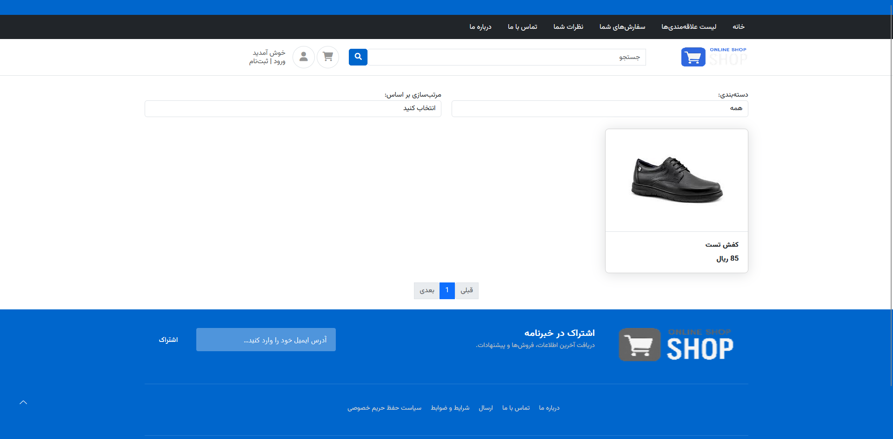
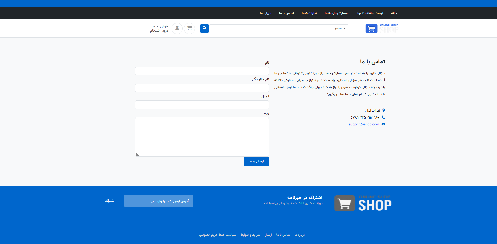
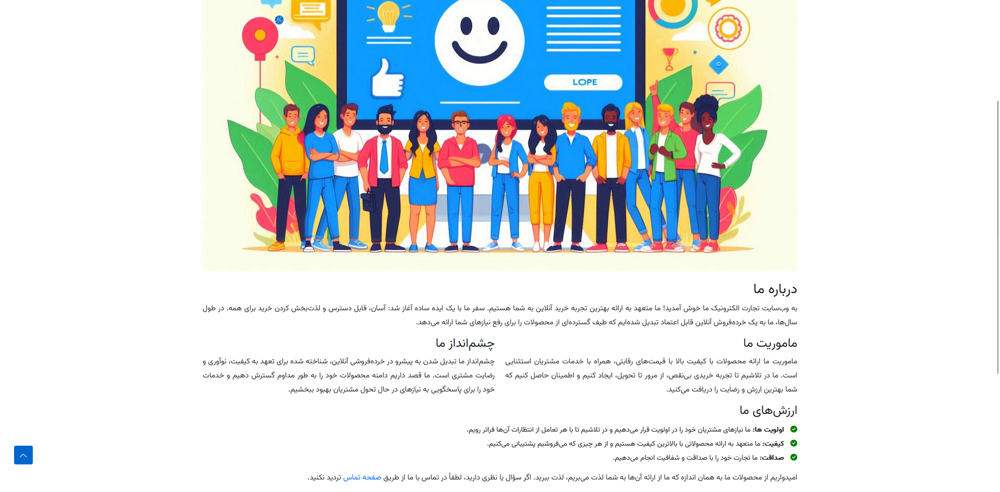
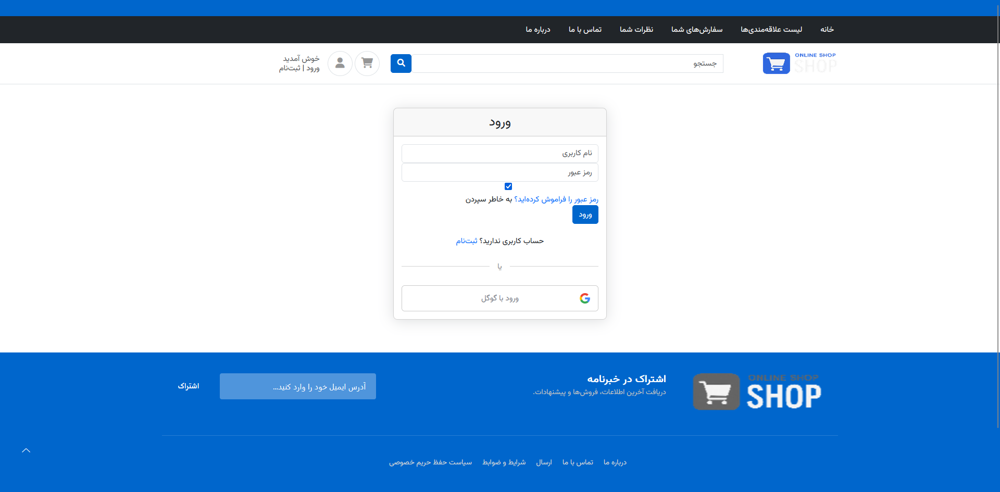
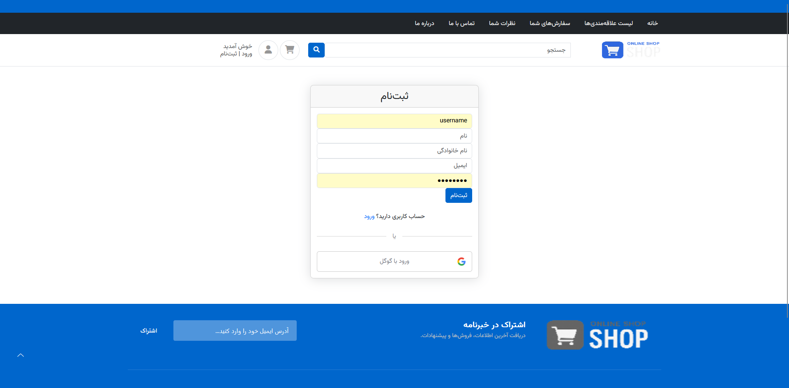
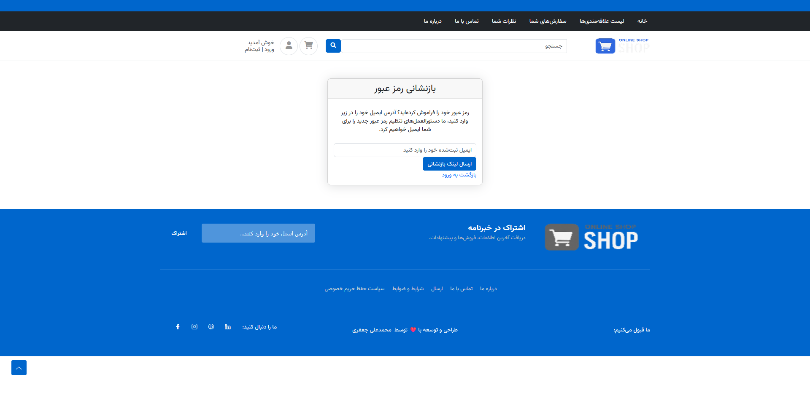

# فروشگاه جنگو

این پروژه یک وبسایت فروشگاهی تجارت الکترونیک است که با استفاده از فریمورک Django ساخته شده است. این وبسایت دارای ویژگی های ضروری مانند احراز هویت کاربر، جستجوی کالا، مدیریت سبد خرید است

## قابلیت ها

- **احراز هویت کاربر:** ثبت نام، ورود، تغییر رمز عبور و تغییر پروفایل کاربر
- **سبد خرید:** اضافه کردن، بروزرسانی و حذف محصولات
- **مدیریت سفارش:** مشاهده تاریخچه سفارش و بروزرسانی وضعیت
- **پنل ادمین:** مدیریت محصولات، سفارشات و کاربران با استفاده از پنل ادمین جنگو

## اسکرین شات ها

### خانه

### تماس با ما

### درباره ما

### ورود

### ثبت نام

### بازنشانی رمز عبور

## ابزار های استفاده شده
- **Django:** فریمورگ جنگو
- **HTML/CSS/JavaScript:** توسعه فرانت-اند  
- **Bootstrap:** فریم‌ورک فرانت اند
